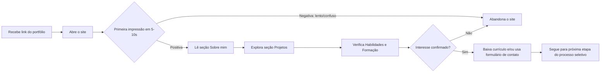

# 👤 Personas e Público-Alvo — Portfólio Web Pessoal

## 1. Por que definir personas em um portfólio pessoal?

Mesmo sendo um projeto pessoal, o portfólio tem um **usuário final que não é o próprio desenvolvedor**: é quem vai avaliá-lo profissionalmente. Definir personas ajuda a tomar decisões de conteúdo e design com foco no objetivo real do projeto (conseguir estágio/emprego), evitando que o site seja construído apenas com base no gosto pessoal do desenvolvedor.

## 2. Persona Primária: Recrutador(a) Técnico(a) / Analista de RH

| Atributo | Descrição |
|---|---|
| **Nome fictício** | Camila Torres |
| **Idade** | 29 anos |
| **Cargo** | Analista de Recrutamento e Seleção (Tech Recruiter) em empresa de médio porte |
| **Contexto de uso** | Recebe dezenas de currículos por vaga de estágio/júnior; acessa o portfólio pelo link enviado no currículo ou LinkedIn |
| **Tempo médio de avaliação** | 30 a 90 segundos por portfólio, antes de decidir se aprofunda a leitura |
| **Dispositivo mais provável** | Notebook/desktop corporativo, mas pode abrir rapidamente pelo celular também |

### Objetivos da persona
- Confirmar rapidamente se o candidato tem potencial técnico para a vaga.
- Entender, sem esforço, quais tecnologias o candidato domina.
- Visualizar projetos reais (não apenas descrições) para validar competência prática.
- Encontrar rapidamente o contato e o currículo para dar sequência ao processo.

### Frustrações comuns (o que o portfólio deve evitar)
- Sites lentos ou quebrados no celular.
- Falta de clareza sobre o nível de senioridade do candidato (estagiário vs. pleno).
- Projetos sem explicação de contexto (só um link de GitHub sem descrição não converte).
- Dificuldade em encontrar e-mail, LinkedIn ou botão de currículo.

### Como o portfólio atende essa persona
- Seção "Sobre mim" no topo, deixando claro o momento de carreira (estudante de ADS buscando estágio).
- Seção "Projetos" com contexto, problema resolvido e tecnologias usadas — não apenas links soltos.
- Botão de currículo em destaque, sempre visível.
- Contato acessível em no máximo 1 clique a partir de qualquer seção.
- Performance rápida mesmo em redes corporativas ou 4G.

## 3. Persona Secundária: Tech Lead / Desenvolvedor(a) Sênior Avaliador(a) Técnico

| Atributo | Descrição |
|---|---|
| **Nome fictício** | Rafael Menezes |
| **Idade** | 35 anos |
| **Cargo** | Tech Lead responsável pela etapa técnica do processo seletivo |
| **Contexto de uso** | Recebe o portfólio já filtrado pelo RH; quer avaliar profundidade técnica |

### Objetivos da persona
- Avaliar a qualidade do código-fonte (organização, boas práticas, uso de Git).
- Entender as decisões técnicas por trás dos projetos (não só "o que" mas "como e por quê").
- Verificar se o candidato entende conceitos além do "tutorial básico" (ex.: responsividade real, acessibilidade, performance).

### Como o portfólio atende essa persona
- Links diretos para os repositórios no GitHub em cada projeto.
- Código organizado e documentado (RNF21, RNF22, RNF23).
- O próprio portfólio serve como prova de competência técnica (uso de React, boas práticas de acessibilidade e SEO, responsividade).
- Esta própria documentação de requisitos pode ser referenciada/linkada como diferencial, demonstrando maturidade de processo.

## 4. Persona Terciária: Colega de Curso / Comunidade Dev

| Atributo | Descrição |
|---|---|
| **Contexto de uso** | Acessa o portfólio via redes sociais (LinkedIn, GitHub, grupos de estudo) por interesse em networking ou inspiração |

### Objetivos da persona
- Conhecer o percurso de estudos do desenvolvedor.
- Trocar experiências ou oportunidades (indicações, parcerias em projetos).

### Como o portfólio atende essa persona
- Seção de formação acadêmica visível.
- Links de redes sociais no rodapé/contato.

## 5. Jornada do Usuário Principal (Recrutador)

## 6. Implicações diretas para o design e conteúdo

Com base nas personas acima, ficam definidas as seguintes diretrizes de priorização:

1. A seção "Sobre mim" deve deixar claro, nas primeiras linhas, o **momento de carreira** do candidato (estudante de ADS buscando estágio/primeiro emprego).
2. Cada projeto exibido deve responder a três perguntas em sua descrição: **qual problema resolve, quais tecnologias usa, e o que foi aprendido/desafiador**.
3. O botão de contato e o download de currículo devem estar **sempre acessíveis**, idealmente fixos ou repetidos ao final da página.
4. A qualidade técnica do próprio site (performance, acessibilidade, responsividade) é, em si, uma peça de demonstração de competência — reforçando o valor dos Requisitos Não Funcionais definidos no documento `04-requisitos-nao-funcionais.md`.
