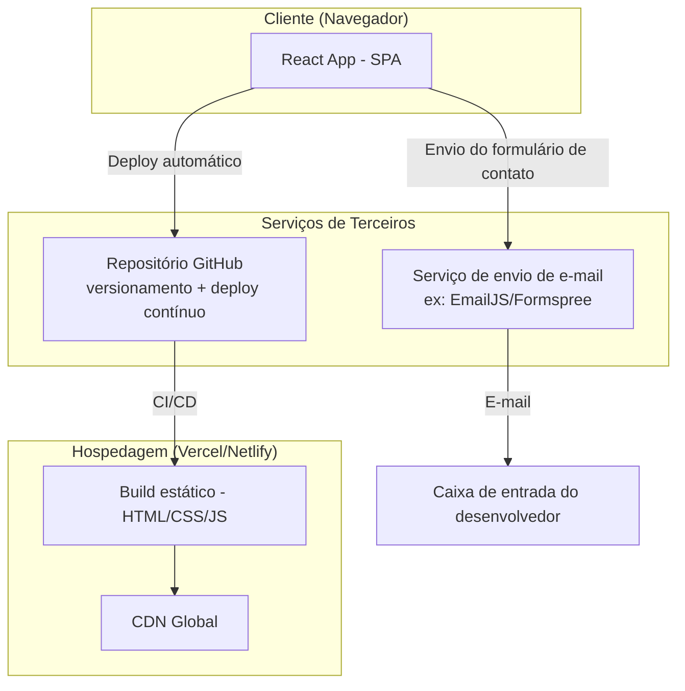

# 🏗️ Arquitetura e Stack Tecnológica — Portfólio Web Pessoal

## 1. Visão Geral da Arquitetura

O projeto será desenvolvido como uma aplicação **front-end estática/SPA (Single Page Application)**, sem necessidade de backend próprio, hospedada em uma plataforma de deploy contínuo (Vercel ou Netlify). A única "funcionalidade de backend" necessária — o envio do formulário de contato — será resolvida por meio de um serviço de terceiros gratuito, evitando a necessidade de manter servidor ou banco de dados.



## 2. Justificativa da Escolha do React

Conforme definido na elicitação de requisitos, o solicitante optou por **React** como framework. Justificativas técnicas que reforçam essa escolha:

- Ampla adoção no mercado, aumentando a relevância do projeto como demonstração de competência para recrutadores.
- Ecossistema maduro de bibliotecas para os requisitos do projeto (roteamento, animações, formulários).
- Facilidade de estruturação em componentes reutilizáveis (alinhado ao RNF21).
- Grande quantidade de documentação e suporte de comunidade, o que favorece o desenvolvimento assistido por IA (RF/RNF apoiados por agentes de IA, conforme cronograma).

## 3. Stack Tecnológica Proposta

| Camada | Tecnologia sugerida | Observação |
|---|---|---|
| **Framework** | React (via Vite) | Vite é recomendado por build mais rápido que Create React App (hoje descontinuado) |
| **Linguagem** | JavaScript ou TypeScript | TypeScript é recomendado como diferencial técnico para recrutadores, mas JavaScript é aceitável se o prazo/aprendizado pedir simplicidade |
| **Estilização** | Tailwind CSS ou CSS Modules | Tailwind acelera a prototipagem de um design minimalista/clean e facilita dark mode |
| **Roteamento** | React Router (se multi-página) ou apenas scroll/âncoras (se single page) | Depende da decisão final de estrutura (ver seção 5) |
| **Animações** | Framer Motion (opcional, para RF18) | Usar com moderação para não comprometer performance (RNF16) |
| **Ícones** | Lucide React ou React Icons | Para representar tecnologias na seção de habilidades |
| **Formulário de contato** | EmailJS, Formspree ou Web3Forms | Todas possuem planos gratuitos suficientes para o volume esperado de um portfólio pessoal |
| **Hospedagem/Deploy** | Vercel ou Netlify | Ambas com integração direta ao GitHub e deploy automático a cada push |
| **Versionamento** | Git + GitHub | Também funciona como vitrine de código para avaliação técnica (persona secundária) |
| **Analytics (opcional)** | Plausible, Vercel Analytics ou Google Analytics | Pendente de definição (ver requisito RF21 em aberto) |

## 4. Estrutura de Pastas Sugerida

```
portfolio/
├── public/
│   ├── curriculo.pdf
│   ├── favicon.ico
│   └── robots.txt
├── src/
│   ├── assets/
│   │   ├── images/
│   │   └── icons/
│   ├── components/
│   │   ├── layout/
│   │   │   ├── Header.jsx
│   │   │   ├── Footer.jsx
│   │   │   └── ThemeToggle.jsx
│   │   ├── sections/
│   │   │   ├── Hero.jsx              (Sobre mim)
│   │   │   ├── Projects.jsx
│   │   │   ├── Skills.jsx
│   │   │   ├── Education.jsx
│   │   │   ├── Experience.jsx
│   │   │   └── Contact.jsx
│   │   └── ui/
│   │       ├── Button.jsx
│   │       ├── Card.jsx
│   │       └── Badge.jsx
│   ├── data/
│   │   ├── projects.js       (conteúdo dos projetos, separado da UI)
│   │   ├── skills.js
│   │   └── experience.js
│   ├── hooks/
│   │   └── useTheme.js
│   ├── context/
│   │   └── ThemeContext.jsx
│   ├── styles/
│   │   └── globals.css
│   ├── App.jsx
│   └── main.jsx
├── .env.example
├── index.html
├── package.json
└── README.md
```

> 💡 **Boa prática:** separar o conteúdo (textos dos projetos, habilidades, experiências) em arquivos de dados (`src/data/`) facilita futuras atualizações sem precisar mexer nos componentes visuais — quase como um "mini CMS" via código.

## 5. Decisão em aberto: Single Page vs. Multi-página

| Opção | Vantagens | Desvantagens |
|---|---|---|
| **Single Page (âncoras)** | Mais simples, navegação fluida, comum em portfólios | Pode ficar longa demais se o conteúdo crescer muito |
| **Multi-página (React Router)** | URLs individuais por seção (melhor para SEO granular, RNF14) | Mais complexidade técnica para um projeto de escopo enxuto |

**Recomendação:** Iniciar como **Single Page com navegação por âncoras**, por ser mais alinhado ao perfil "poucos projetos, foco em objetividade" identificado na elicitação. A migração para multi-página pode ser uma evolução futura natural.

## 6. Considerações de Segurança e Variáveis de Ambiente

- Chaves de API de serviços como EmailJS devem ser armazenadas em variáveis de ambiente (`.env`), nunca commitadas diretamente no repositório (RNF25).
- O arquivo `.env.example` deve ser versionado (sem valores reais) para documentar quais variáveis são necessárias para rodar o projeto localmente.

## 7. Estratégia de Deploy

1. Repositório criado no GitHub (público, para servir também como vitrine).
2. Conexão do repositório à Vercel ou Netlify.
3. Deploy automático a cada `push` na branch principal (CI/CD simples, nativo da plataforma).
4. Variáveis de ambiente configuradas diretamente no painel da plataforma de hospedagem (não apenas localmente).
5. Domínio: uso do subdomínio gratuito oferecido pela plataforma (ex.: `seunome.vercel.app`), com possibilidade de domínio próprio como evolução futura.
