# 🗓️ Cronograma de Desenvolvimento — Portfólio Web Pessoal

## 1. Abordagem do cronograma

Conforme identificado na elicitação de requisitos, **não há prazo fixo definido** para este projeto, e há intenção explícita de utilizar **ferramentas de agentes de IA** como apoio ao desenvolvimento. Por isso, o cronograma abaixo é organizado por **fases lógicas e sequenciais**, e não por datas de calendário — permitindo que o desenvolvedor avance no seu próprio ritmo, mas mantendo uma ordem de execução coerente e evitando retrabalho.

Cada fase indica também **onde o uso de agentes de IA tende a agregar mais valor**, já que essa foi uma decisão explícita do solicitante.

## 2. Visão geral das fases

```mermaid
gantt
    title Fases do Projeto (sem datas fixas - sequência lógica)
    dateFormat X
    axisFormat %s

    section Fase 1 - Planejamento
    Documentação de requisitos      :done, f1, 0, 1

    section Fase 2 - Conteúdo
    Coleta de conteúdo real         :f2, after f1, 1

    section Fase 3 - Design
    Wireframe e paleta visual       :f3, after f2, 1

    section Fase 4 - Setup Técnico
    Setup do projeto React          :f4, after f3, 1

    section Fase 5 - Desenvolvimento
    Implementação das seções        :f5, after f4, 2

    section Fase 6 - Qualidade
    Testes, acessibilidade e SEO    :f6, after f5, 1

    section Fase 7 - Deploy
    Publicação e divulgação         :f7, after f6, 1
```

## 3. Detalhamento das Fases

### ✅ Fase 1 — Planejamento e Documentação (concluída nesta entrega)

**Objetivo:** Definir escopo, requisitos e arquitetura antes de escrever código.

- [x] Elicitação de requisitos
- [x] Escopo do projeto
- [x] Requisitos funcionais e não funcionais
- [x] Persona e público-alvo
- [x] Decisões de arquitetura e stack

**Uso de IA sugerido:** Geração e organização da documentação (como este próprio conjunto de arquivos), revisão de consistência entre os documentos.

---

### 📝 Fase 2 — Coleta de Conteúdo Real

**Objetivo:** Reunir todo o conteúdo textual e visual que vai preencher o site, evitando "lorem ipsum".

- [ ] Escrever texto da seção "Sobre mim" (1-2 parágrafos)
- [ ] Descrever os 1-2 projetos existentes (problema, solução, tecnologias, aprendizados)
- [ ] Listar tecnologias/habilidades (separadas por categoria: linguagens, frameworks, ferramentas)
- [ ] Reunir dados de formação acadêmica (curso, instituição, período)
- [ ] Reunir dados de experiência profissional (se houver)
- [ ] Preparar foto de perfil (profissional, boa qualidade)
- [ ] Atualizar e exportar currículo em PDF
- [ ] Reunir links de contato (e-mail, LinkedIn, GitHub, WhatsApp)

**Uso de IA sugerido:** Apoiar na redação e revisão de textos (tom profissional, concisão), sugerir como descrever projetos de forma mais impactante para recrutadores.

**Pendências desta fase:** revisitar os "Requisitos em aberto" do documento `02-elicitacao-de-requisitos.md` (idioma do site, uso de analytics, paleta de cores).

---

### 🎨 Fase 3 — Design (Wireframe e Identidade Visual)

**Objetivo:** Definir a estrutura visual antes de codificar, mesmo que de forma simples.

- [ ] Wireframe de baixa fidelidade das seções (pode ser em papel, Figma ou até descrito em texto)
- [ ] Definir paleta de cores (modo claro e escuro)
- [ ] Definir tipografia (fontes para títulos e corpo de texto)
- [ ] Definir estilo dos componentes (cards de projeto, botões, badges de tecnologia)

**Uso de IA sugerido:** Geração de sugestões de paleta de cores acessíveis (contraste adequado), geração de variações de layout para escolha.

---

### ⚙️ Fase 4 — Setup Técnico do Projeto

**Objetivo:** Preparar o ambiente de desenvolvimento e a estrutura base do código.

- [ ] Criar repositório no GitHub
- [ ] Inicializar projeto React (via Vite)
- [ ] Configurar Tailwind CSS (ou solução de estilização escolhida)
- [ ] Configurar estrutura de pastas (ver `06-arquitetura-e-stack.md`)
- [ ] Configurar variáveis de ambiente (`.env.example`)
- [ ] Configurar serviço de envio de formulário (EmailJS/Formspree)
- [ ] Conectar repositório à Vercel/Netlify (deploy inicial "Hello World")

**Uso de IA sugerido:** Geração de boilerplate/scaffolding inicial, configuração de ferramentas (Tailwind, ESLint, Prettier).

---

### 💻 Fase 5 — Desenvolvimento das Seções (Implementação)

**Objetivo:** Codificar cada seção do site conforme os Requisitos Funcionais definidos.

- [ ] Layout base (Header, navegação, Footer) — RF14, RF16
- [ ] Toggle de tema claro/escuro — RF12, RF13
- [ ] Seção "Sobre mim" — RF01
- [ ] Seção "Projetos" (cards dinâmicos a partir de `src/data/projects.js`) — RF02, RF15
- [ ] Seção "Habilidades" — RF03
- [ ] Seção "Formação acadêmica" — RF04
- [ ] Seção "Experiência profissional" — RF05
- [ ] Seção "Contato" (formulário + links diretos) — RF06, RF07, RF08, RF09, RF10
- [ ] Botão de download de currículo — RF11
- [ ] Meta tags e Open Graph — RF19

**Uso de IA sugerido:** Geração de componentes React a partir de especificações, revisão de código, sugestões de refatoração para manutenibilidade (RNF21).

---

### 🔍 Fase 6 — Qualidade: Testes, Acessibilidade, SEO e Performance

**Objetivo:** Validar os Requisitos Não Funcionais antes da publicação final.

- [ ] Testar responsividade em 375px, 768px e 1440px — RNF04, RNF06
- [ ] Rodar auditoria Lighthouse (Performance, Acessibilidade, SEO, Boas práticas) — RNF16
- [ ] Verificar contraste de cores em ambos os temas — RNF07
- [ ] Testar navegação completa via teclado — RNF08
- [ ] Verificar leitura por leitor de tela em ao menos uma seção crítica (ex.: formulário) — RNF09
- [ ] Validar HTML semântico — RNF11
- [ ] Testar envio real do formulário de contato — RF07, RF09
- [ ] Testar links diretos (mailto, LinkedIn, GitHub, WhatsApp) — RF10
- [ ] Adicionar `sitemap.xml` e `robots.txt` — RNF15

**Uso de IA sugerido:** Interpretação dos relatórios do Lighthouse/axe DevTools, sugestões de correção para problemas encontrados.

---

### 🚀 Fase 7 — Deploy Final e Divulgação

**Objetivo:** Publicar a versão final e usá-la ativamente na busca por oportunidades.

- [ ] Deploy final em produção (Vercel/Netlify)
- [ ] Testar o site publicado em produção (não apenas localmente)
- [ ] Atualizar LinkedIn com o link do portfólio
- [ ] Incluir o link do portfólio no currículo em PDF
- [ ] Compartilhar em processos seletivos e redes profissionais

**Uso de IA sugerido:** Revisão final de textos e checklist de lançamento.

## 4. Checklist Resumido de Progresso Geral

- [x] Fase 1 — Planejamento e Documentação
- [ ] Fase 2 — Coleta de Conteúdo Real
- [ ] Fase 3 — Design
- [ ] Fase 4 — Setup Técnico
- [ ] Fase 5 — Desenvolvimento das Seções
- [ ] Fase 6 — Qualidade (Testes, Acessibilidade, SEO, Performance)
- [ ] Fase 7 — Deploy Final e Divulgação

> 📌 Recomendação: marcar este checklist como concluído progressivamente, direto neste arquivo `.md`, servindo como registro histórico do avanço do projeto — outra evidência interessante de organização para mostrar a recrutadores, caso este repositório de documentação também seja compartilhado.
